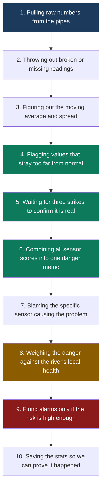

# Industrial Discharge Anomaly Detection System
Monitors industrial wastewater streams live to catch toxic dumps before they hit the river.

---

## The Problem
Factories dump wastewater into treatment plants around the clock. Without live monitoring, a massive chemical dump goes unnoticed until it kills the bacteria in the treatment plant. A five-minute delay means thousands of liters of toxic water pass the intake valves before anyone turns off the pumps. 

## What This Does
* Watches sensor inputs continuously so nothing slips by.
* Detects sudden changes using rolling math instead of fixed rules.
* Filters out random sensor noise to stop false alarms.
* Scores the danger level based on the specific river's health.
* Alerts operators instantly when a real chemical threat emerges.
* Explains exactly which sensor triggered the alarm.
* Tracks system performance in the background for audits.

## How Data Flows



This diagram shows how we turn messy water data into a reliable pager beep. Raw numbers enter at the top, get cleaned, scored, and finally pushed out as an alert if the math says it is a real threat.

## The 3 Ideas That Make It Work

### Idea 1 — Self-Calibrating Detection
Water changes hour by hour. A fixed limit causes false alarms during rainstorms. This system uses a sliding window to figure out what normal looks like right now. It triggers when the current reading is violently different from the recent past.

### Idea 2 — Multivariate Intelligence
A tiny drop in pH might not matter alone. A tiny drop in pH while turbidity spikes is often a chemical dump. The system looks at all the sensors as a single group. This catches coordinated patterns that single-sensor math ignores.

### Idea 3 — Environmental Risk Index
The same chemical spill does different damage depending on where it happens. Pumping bad water into a dry river is worse than pumping it into a flooded one. This index scales the final alert score based on how fragile the receiving water is.

## Project Structure
```bash
.
├── src/
│   ├── ingest.py         # Reads data from the message queue
│   ├── validation.py     # Drops rows with missing or bad data
│   ├── windowed_stats.py # Calculates rolling averages and spread
│   ├── zscore.py         # Finds anomalies using math
│   ├── persistence.py    # Stops single-tick false alarms
│   ├── multivariate.py   # Combines sensors into one score
│   ├── attribution.py    # Finds the worst broken sensor
│   ├── eri.py            # Adjusts danger by river health
│   ├── alerts.py         # Decides who gets paged right now
│   ├── metrics.py        # Logs system latency and counts
│   └── logger.py         # Standardizes our terminal output
├── config.py             # All strict settings in one place
├── demo_script.py        # Fake a whole incident end-to-end
├── inject_anomaly.py     # Poke the system with bad data
└── main.py               # Wires it all together and runs it
```

## Getting Started

Step 1 — Install dependencies  
`pip install -r requirements.txt`

Step 2 — Configure  
Open `config.py` and set your defaults. The most important settings for a new user are `ZSCORE_THRESHOLD`, `WINDOW_SECONDS`, and `PERSISTENCE_COUNT`.

Step 3 — Run  
```bash
# Start the pipeline
python main.py

# Run the full demo (fast mode = compressed timing)
python demo_script.py --fast

# Manually fire a test anomaly
python inject_anomaly.py --sensor-id pH --anomaly-type spike
```

## Configuration Quick Reference

| Parameter | Default | What it controls |
|---|---|---|
| ZSCORE_THRESHOLD | 3.0 | How sensitive anomaly detection is |
| PERSISTENCE_COUNT | 3 | How many hits before confirming an anomaly |
| ALERT_MIN_RISK_BAND | MEDIUM | Minimum severity level to send an alert |
| WINDOW_SECONDS | 300 | How far back rolling stats look |
| RIVER_SENSITIVITY | per-point | How fragile the receiving ecosystem is |

All parameters live in `config.py` and validate on startup to prevent silent crashes.

## Sample Alert Output

```json
{
  "sensor_id": "outfall_4",             # The specific meter that tripped the wire
  "timestamp": "2026-02-28T12:00:00Z",  # When the bad water actually hit the sensor
  "z_score": 4.12,                      # How many standard deviations off normal we are
  "composite_score": 18.5,              # Total combined weirdness from the sensor group
  "eri": 8.9,                           # Environmental Risk Index score out of 10
  "risk_band": "HIGH",                  # The category deciding who gets woken up
  "alert_level": "CRITICAL",            # The severity level for the actual pager message
  "top_contributor": "turbidity",       # The metric causing the most trouble right now
  "alert_message": "Sharp pH drop",     # Human-readable explanation of why we care
  "latency_ms": 42                      # How long it took the code to figure this out
}
```

An operator looks at the top contributor and the message, then immediately calls the factory floor to stop the pumps.

## Why Pathway

This codebase needs to handle data that arrives late or out of order. A simple Python loop cannot handle sliding windows over out-of-order streams without a ton of messy state management. Pathway handles the incremental recomputations automatically under the hood. It makes streaming joins actually bearable to write. The functional syntax takes a day or two to fully wrap your head around, but it deletes hundreds of lines of boilerplate code.
